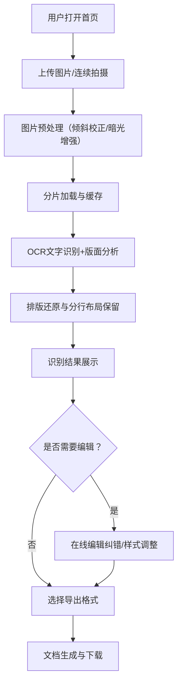

## 1. 产品概述

本项目是一款基于AI的图像解析与文字识别服务，专为手写笔记、作业本、手稿等文档场景设计。通过OCR技术智能识别手写文字内容，精确保留原文档的排版结构和分行布局，支持在线编辑纠错、字体样式调整，并可导出为多种常用文档格式。

- 核心目标：解决手写内容数字化、可编辑化的需求，提升笔记整理和知识管理效率
- 目标用户：学生、教师、研究人员、知识工作者、手写爱好者
- 产品价值：将纸质手写内容快速转换为可编辑电子文档，保留原始排版，大幅减少人工录入时间

## 2. 核心功能

### 2.1 用户角色

| 角色 | 注册方式 | 核心权限 |
|------|----------|----------|
| 普通用户 | 无需注册，直接使用 | 上传图片、文字识别、在线编辑、导出文档 |

### 2.2 功能模块

1. **首页/工作台**：图片上传区、识别历史列表、操作指引
2. **识别编辑页**：图片预览、识别结果展示、在线编辑器、样式调整面板
3. **导出功能**：多格式导出选择、下载确认

### 2.3 页面详情

| 页面名称 | 模块名称 | 功能描述 |
|----------|----------|----------|
| 首页/工作台 | 上传区域 | 支持拖拽上传、点击选择、连续多图上传、图片格式校验、大小限制提示 |
| 首页/工作台 | 图片预览缩略图 | 已上传图片的缩略图展示、删除、重新排序功能 |
| 首页/工作台 | 历史记录 | 最近识别任务列表、状态显示、重新编辑入口 |
| 识别编辑页 | 原图预览 | 图片缩放、旋转、对比度调整、倾斜校正预览 |
| 识别编辑页 | 识别结果区 | 分块识别结果展示、与原图区域对应高亮、排版还原展示 |
| 识别编辑页 | 富文本编辑器 | 文字编辑纠错、光标定位、文本选择、复制粘贴 |
| 识别编辑页 | 样式工具栏 | 字体切换、字号调整、粗体/斜体/下划线、颜色调整、段落对齐 |
| 识别编辑页 | 分页处理 | 长页内容自动分页、手动分页符插入、页面预览切换 |
| 导出面板 | 格式选择 | Word (.docx)、PDF、TXT、Markdown 四种导出格式 |
| 导出面板 | 导出设置 | 页边距设置、是否包含原图、导出质量选项 |

## 3. 核心流程

用户打开首页后，通过拖拽或点击上传手写文档图片（支持批量连续上传）。系统对图片进行预处理（倾斜校正、暗光增强）后，调用OCR引擎进行文字识别和版面分析。识别完成后，用户进入编辑页面查看还原后的排版，可以对识别错误的文字进行人工校对，调整字体样式和段落格式，必要时可手动插入分页符。编辑完成后选择目标格式（Word/PDF/TXT/Markdown）进行导出下载。系统对请求进行限流控制，大图片采用分片加载策略，识别过程文件缓存在独立存储分区。

## 4. 用户界面设计

### 4.1 设计风格

- **主色调**：深色科技感主题，采用深邃藏蓝 `#0F172A` 作为背景主色，搭配青色 `#06B6D4` 作为主强调色，琥珀橙 `#F59E0B` 作为辅助强调色
- **按钮风格**：圆角胶囊形按钮，悬停时有微微发光效果和上浮动画，主按钮使用青色渐变，次按钮为描边透明底
- **字体**：标题使用等宽机械感字体 `JetBrains Mono`，正文使用清晰易读的 `Noto Sans SC`，识别结果预览区使用仿真手写风格字体增强体验
- **布局风格**：左右分栏双面板布局，左侧为原图预览，右侧为编辑区，顶部悬浮导航栏带磨砂玻璃效果
- **图标风格**：线性简洁图标配合微动效，关键操作使用彩色图标增强辨识度

### 4.2 页面设计概览

| 页面名称 | 模块名称 | UI元素 |
|----------|----------|--------|
| 首页/工作台 | 上传区域 | 虚线边框拖拽区、相机/文件图标、悬浮波点动画、多图缩略图横向滚动列表 |
| 首页/工作台 | 历史记录 | 卡片式列表、悬浮状态标签、时间戳显示、进度条动画 |
| 识别编辑页 | 原图预览 | 图片缩放滑块、旋转按钮、对比度调节、边框发光选中效果 |
| 识别编辑页 | 编辑区 | 白色纸张质感背景、行号显示、悬停高亮识别块、仿真网格线 |
| 识别编辑页 | 工具栏 | 固定顶部悬浮、分组图标按钮、下拉选择器带搜索、快捷操作气泡提示 |
| 识别编辑页 | 分页控件 | 底部页签式分页器、当前页高亮、总页数显示、页码跳转输入框 |
| 导出面板 | 模态弹窗 | 半透明磨砂遮罩、卡片式格式选项、勾选开关设置、进度条加载 |

### 4.3 响应式设计

- 桌面端优先设计，最小支持宽度 1280px
- 平板端：双栏变上下单栏布局，工具栏自动折叠为汉堡菜单
- 移动端：隐藏非核心功能，保留上传和查看识别结果的基础能力
- 触控优化：按钮最小点击区域 44x44px，支持双指缩放图片预览

### 4.4 视觉动效

- 页面加载：元素错峰淡入动画，上传区域先出现后扩展
- 识别过程：进度条带有流动光效，文字逐行浮现效果
- 悬停交互：卡片微微上浮+阴影加深，按钮背景色渐变过渡
- 编辑状态：光标闪烁动画，文字修改时有轻微的高亮波纹
