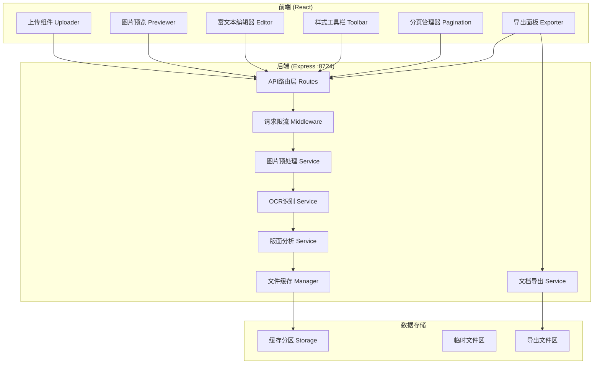
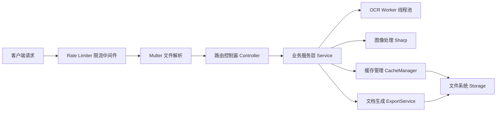
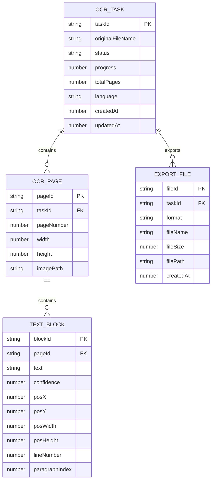

## 1. 架构设计



## 2. 技术描述

- **前端**：React@18 + TypeScript + Vite + TailwindCSS@3
- **富文本编辑**：TipTap (基于 ProseMirror)
- **后端**：Node.js + Express@4 + TypeScript
- **OCR引擎**：Tesseract.js (JavaScript本地OCR，支持中文识别)
- **图像处理**：Sharp (图片预处理、缩放、旋转、对比度调整)
- **文档导出**：docx (Word导出)、pdfkit (PDF导出)
- **文件上传**：Multer (分片上传支持)
- **请求限流**：express-rate-limit
- **缓存存储**：本地文件系统独立分区 (`./storage/cache`)
- **并发处理**：Worker Threads (OCR识别多线程)

## 3. 路由定义

| 路由 | 方法 | 用途 |
|------|------|------|
| / | GET | 前端静态页面 |
| /api/upload | POST | 上传图片（支持分片） |
| /api/ocr/:taskId | POST | 执行OCR识别 |
| /api/tasks/:taskId | GET | 查询识别任务状态 |
| /api/tasks/:taskId/result | GET | 获取识别结果 |
| /api/export/:taskId | POST | 导出文档 |
| /api/export/:fileId/download | GET | 下载导出文件 |
| /api/history | GET | 获取识别历史记录 |

## 4. API 定义

### 4.1 类型定义

```typescript
// 上传响应
interface UploadResponse {
  taskId: string;
  fileName: string;
  fileSize: number;
  chunkIndex?: number;
  totalChunks?: number;
  uploaded: boolean;
}

// OCR任务状态
interface OCRTask {
  taskId: string;
  status: 'pending' | 'processing' | 'completed' | 'failed';
  progress: number;
  totalPages: number;
  currentPage: number;
  createdAt: number;
  updatedAt: number;
}

// 识别结果数据结构
interface OCRResult {
  taskId: string;
  pages: OCRPage[];
  metadata: {
    originalFileName: string;
    totalPages: number;
    language: string;
    createdAt: number;
  };
}

interface OCRPage {
  pageNumber: number;
  width: number;
  height: number;
  blocks: TextBlock[];
  imageUrl: string;
}

interface TextBlock {
  id: string;
  text: string;
  confidence: number;
  boundingBox: {
    x: number; y: number; width: number; height: number;
  };
  lineNumber: number;
  paragraphIndex: number;
}

// 导出请求
interface ExportRequest {
  taskId: string;
  format: 'docx' | 'pdf' | 'txt' | 'md';
  options: {
    includeImage: boolean;
    fontSize?: number;
    fontFamily?: string;
    pageMargin?: number;
  };
}

interface ExportResponse {
  fileId: string;
  fileName: string;
  fileSize: number;
  downloadUrl: string;
}
```

### 4.2 请求响应结构

- 所有API响应统一格式：`{ code: number, data: any, message: string }`
- 错误码：200成功 / 400参数错误 / 429限流 / 500服务错误
- 限流规则：每分钟最多30次请求，单IP并发最多3个识别任务

## 5. 服务器架构



## 6. 数据模型

### 6.1 数据结构



### 6.2 本地存储结构

```
storage/
├── cache/                 # 文件缓存独立分区
│   └── tasks/             # 任务缓存
│       └── {taskId}/
│           ├── original/  # 原始图片
│           ├── processed/ # 预处理后图片
│           └── result.json
└── exports/               # 导出文件区
    └── {fileId}.{format}
```
